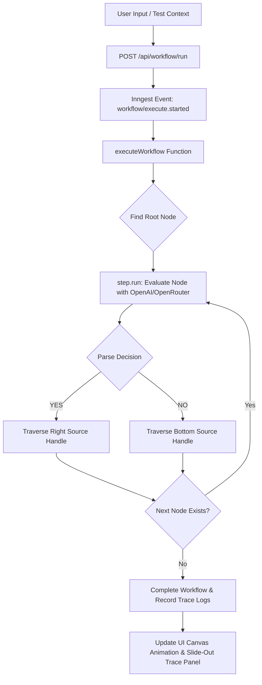

# ⚡ Visual AI Workflow System

A high-performance visual, node-based workflow engine built with **Next.js 16 (App Router)**, **React Flow** (`@xyflow/react`), **Inngest**, and **OpenAI / OpenRouter**.


---

## 🌟 Key Features

- 🎨 **Interactive React Flow Canvas:** Drag, drop, scale, and connect custom decision nodes seamlessly.
- 🔀 **Binary Decision Nodes (`YES` / `NO` Branching):** Custom `DecisionNode` with target input handle on top, right-side `YES` (emerald) handle, and bottom-side `NO` (red) handle.
- ⚡ **Durable Inngest Execution Engine:** Background workflow orchestration via `inngest.createFunction` wrapping step-by-step traversal with `step.run()`.
- 🤖 **LLM-Powered Decision Routing:** Leverages OpenAI / OpenRouter API to evaluate conditions against user input and strictly return binary JSON decisions (`YES` / `NO`) with concise reasoning.
- 📜 **Live Execution Logs & Trace Sheet:** Slide-out drawer displaying real-time step execution, decision badges, prompt conditions, and reasoning traces.
- ✨ **Animated Path Traversal:** Visual highlighting of traversed nodes and glowing color-coded animated edges representing the exact decision path chosen by the AI.
- 💾 **JSON Import & Export:** Save workflow graph topologies to JSON files and restore canvas layouts anytime.
- 🛡️ **Graph Validation & Error Prevention:** Automatic pre-flight checks ensuring prompts are configured and nodes are connected before execution.

---

## 🏗️ System Architecture



---

## 🚀 Getting Started

### 1. Prerequisites
- **Node.js** v18+ 
- **npm** (or `pnpm` / `yarn` / `bun`)

### 2. Environment Configuration

Copy `.env.example` to `.env.local`:

```bash
cp .env.example .env.local
```

Set your credentials in `.env.local`:
```env
OPENAI_BASE_URL=https://openrouter.ai/api/v1
OPENAI_API_KEY=your_openrouter_api_key_here
OPENAI_MODEL=openrouter/free
INNGEST_EVENT_KEY=local
INNGEST_SIGNING_KEY=local
```

> **Note:** If no `OPENAI_API_KEY` is set, the workflow engine automatically uses an intelligent heuristic fallback mechanism to evaluate decision conditions.

### 3. Install Dependencies

```bash
npm install
```

### 4. Run Development Servers

#### Next.js App Server:
```bash
npm run dev
```
Open [http://localhost:3000](http://localhost:3000) in your browser.

#### Inngest Local Dev Server (Optional):
```bash
npx inngest-cli@latest dev
```
Open [http://localhost:8288](http://localhost:8288) to access the Inngest local development dashboard.

---

## 💾 Workflow JSON Schema (Import / Export)

```json
{
  "version": "1.0",
  "nodes": [
    {
      "id": "1",
      "type": "decisionNode",
      "position": { "x": 250, "y": 60 },
      "data": {
        "title": "Email Intent Classifier",
        "prompt": "Is this incoming email an urgent customer support or technical issue?"
      }
    }
  ],
  "edges": [
    {
      "id": "e1-2",
      "source": "1",
      "sourceHandle": "yes",
      "target": "2",
      "targetHandle": "input",
      "label": "YES"
    }
  ]
}
```

---

## 🛠️ Stack Summary

- **Framework:** Next.js 16 (App Router, TypeScript)
- **Styling:** Tailwind CSS v4, Shadcn UI
- **Workflow Canvas:** `@xyflow/react` (React Flow 12)
- **Durable Orchestration:** `inngest`
- **AI SDK:** `openai` (configured with OpenRouter endpoint)
- **Toast Notifications:** `sonner`
- **Icons:** `lucide-react`
