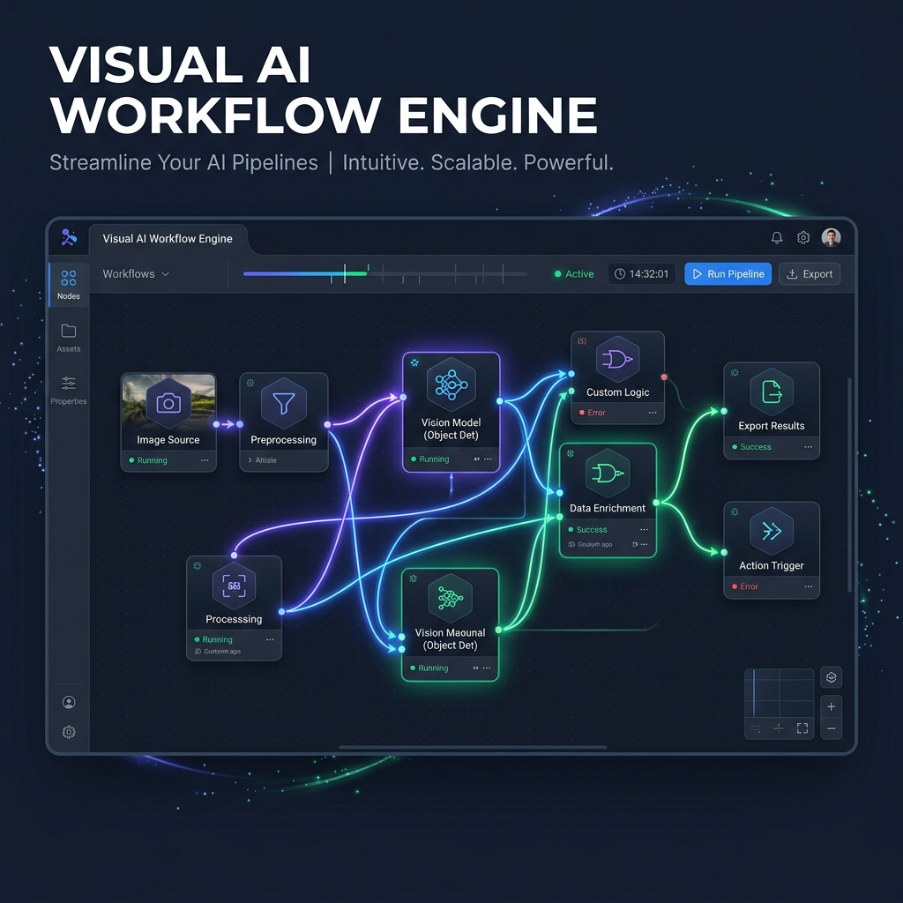
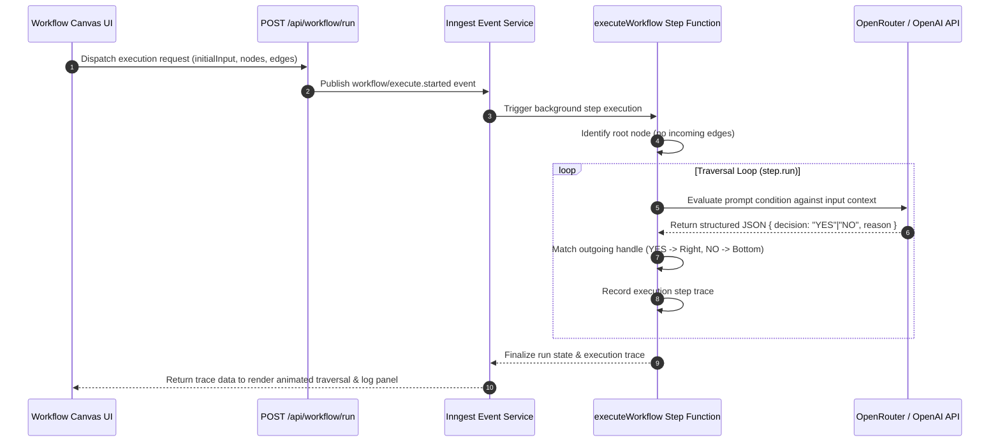
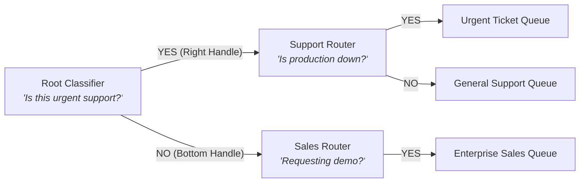

<div align="center">
  
  
  # Visual AI Workflow Engine
  
  **Enterprise-grade, node-based LLM decision routing and durable background workflow orchestration engine.**

  [](https://nextjs.org/)
  [](https://www.typescriptlang.org/)
  [](https://reactflow.dev/)
  [](https://www.inngest.com/)
  [](https://openrouter.ai/)
</div>

---

## System Overview

The Visual AI Workflow Engine is a visual programming environment that enables users to design, test, and orchestrate non-linear decision trees powered by Large Language Models (LLMs). Built on top of Next.js 16, React Flow, and Inngest, the platform translates visual node topologies into durable, fault-tolerant background execution chains.

---

## Core Capabilities

| Capability | Technical Implementation | Value Proposition |
| :--- | :--- | :--- |
| **Interactive Node Editor** | `@xyflow/react` v12 with custom node type definitions | Drag-and-drop workflow editing with dynamic handle routing |
| **Binary Decision Nodes** | Dual source handles (`YES` / `NO`) with stateful inputs | Deterministic branching based on natural language prompt evaluation |
| **Durable Execution Engine** | Inngest step functions (`step.run()`) | Zero state-loss workflow execution with automatic retry guarantees |
| **LLM Decision Agent** | OpenAI API / OpenRouter with JSON schema constraints | Reliable binary classification with structured justification traces |
| **Path Traversal Visualization** | Dynamic edge styling, animated SVG markers, and node glow states | Immediate visual feedback showing exact AI execution paths |
| **Execution Logging & Audit** | Slide-out sheet panel powered by Shadcn UI | Full auditability of evaluation steps, prompts, and timestamps |
| **Graph Serialization** | Schema-validated JSON import and export handlers | Portability, version control, and offline workflow backup |

---

## Architecture Breakdown

### Execution Sequence Lifecycle



---

<details>
<summary><strong>View Workflow Node Topology Architecture</strong></summary>



</details>

---

## API Specification

### 1. Trigger Workflow Execution

```http
POST /api/workflow/run
Content-Type: application/json
```

#### Request Payload
| Field | Type | Description |
| :--- | :--- | :--- |
| `initialInput` | `string` | The text context or user message evaluated by decision nodes |
| `nodes` | `Array<Node>` | Array of React Flow node objects containing prompts and positions |
| `edges` | `Array<Edge>` | Array of React Flow edge objects defining graph connections |

#### Response Example
```json
{
  "success": true,
  "runId": "run_1724158921000_a8f9b",
  "eventId": "01J5K9X0M8N7P6Q5R4S3T2U1V0",
  "message": "Workflow execution triggered successfully via Inngest"
}
```

---

<details>
<summary><strong>View Inngest Serve Endpoint Details</strong></summary>

### 2. Inngest Serve Endpoint

```http
POST /api/inngest
GET /api/inngest
PUT /api/inngest
```

Handler endpoint serving registered background functions to the Inngest executor daemon.

</details>

---

## Deployment & Setup Guide

### Prerequisites
- Node.js v18.0.0 or higher
- npm v9.0.0 or higher

### Environment Configuration

Create a `.env.local` file in the project root:

```ini
OPENAI_BASE_URL=https://openrouter.ai/api/v1
OPENAI_API_KEY=your_api_key_here
OPENAI_MODEL=openrouter/free
INNGEST_EVENT_KEY=local
INNGEST_SIGNING_KEY=local
```

### Installation

```bash
# Clone the repository
git clone https://github.com/shahrukhfu/visual-ai-workflow-engine.git
cd visual-ai-workflow-engine

# Install project dependencies
npm install
```

### Running Locally

```bash
# Start Next.js development server
npm run dev

# (Optional) Start Inngest local dev dashboard
npx inngest-cli@latest dev
```

Open [http://localhost:3000](http://localhost:3000) to access the interactive workflow editor.

---

<details>
<summary><strong>View Workflow Graph JSON Format</strong></summary>

```json
{
  "version": "1.0",
  "nodes": [
    {
      "id": "1",
      "type": "decisionNode",
      "position": { "x": 250, "y": 60 },
      "data": {
        "title": "Email Intent Classifier",
        "prompt": "Is this incoming email an urgent customer support or technical issue?"
      }
    }
  ],
  "edges": [
    {
      "id": "e1-2",
      "source": "1",
      "sourceHandle": "yes",
      "target": "2",
      "targetHandle": "input",
      "label": "YES"
    }
  ]
}
```

</details>

---

## Verification & Production Build

To compile and validate the TypeScript codebase for production:

```bash
npm run build
```
